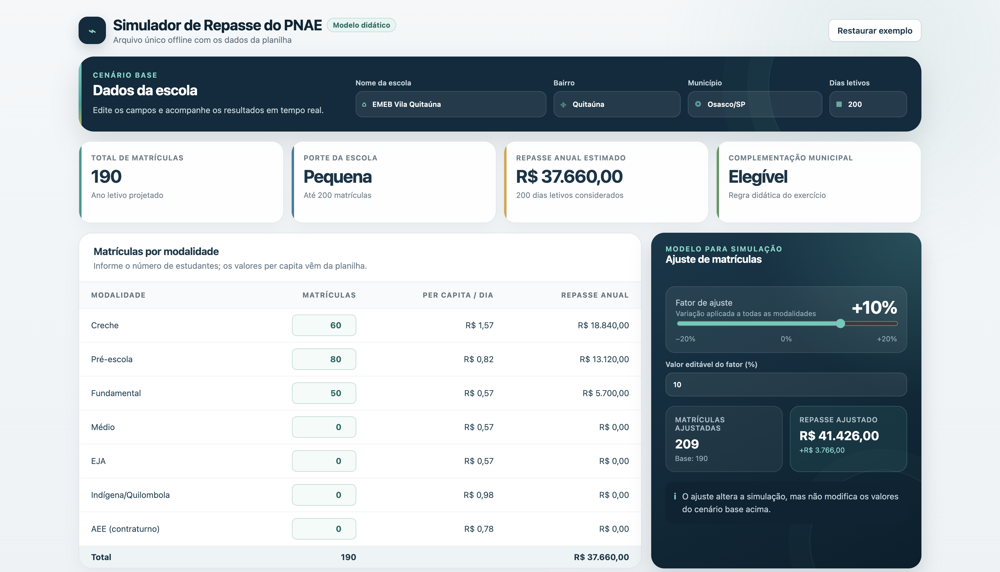
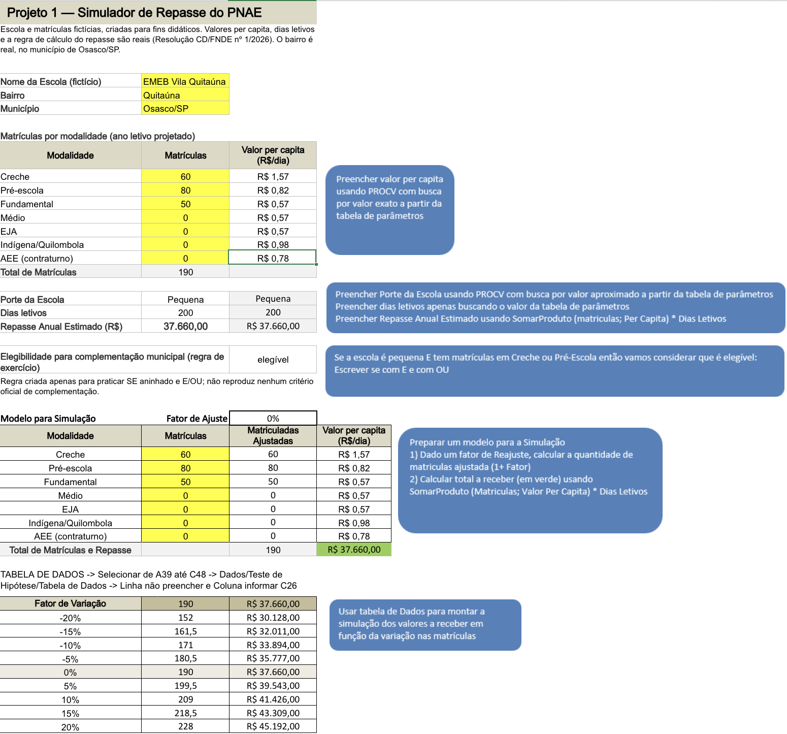

# Projeto 1 — Simulador de Repasse do PNAE

## Objetivo

Este projeto apresenta um simulador didático de repasse do Programa Nacional de Alimentação Escolar (PNAE).

A planilha calcula o repasse anual estimado a partir da quantidade de matrículas por modalidade, dos valores per capita de referência e do número de dias letivos adotados no exercício.

Além do cálculo principal, o modelo classifica o porte da escola, aplica uma regra didática de elegibilidade para complementação municipal e apresenta cenários de sensibilidade com diferentes variações nas matrículas.

> **Observação:** as faixas de porte e a regra de elegibilidade foram criadas para fins didáticos e não representam critérios oficiais de complementação municipal.

## Arquivos

- `simulador-pnae.xlsx` — planilha-base com parâmetros, fórmulas e simulações.
- `simulador-pnae.html` — versão interativa do simulador, preparada para funcionar offline no navegador.
- `README.md` — documentação do projeto.

## Como usar

### Planilha Excel

1. Abra o arquivo `simulador-pnae.xlsx` no Excel.
2. Acesse a aba do simulador.
3. Altere as quantidades de matrículas das modalidades.
4. Observe os resultados calculados automaticamente.
5. Utilize a área de cenários para analisar os efeitos das variações nas matrículas.

### Simulador HTML

1. Abra o arquivo `simulador-pnae.html`.
2. O arquivo será aberto no navegador.
3. Altere os dados da escola, número de dias letivos e matrículas.
4. Os resultados são atualizados automaticamente.
5. Utilize o fator de ajuste para testar cenários de -20% a +20%.

O HTML funciona de forma independente da planilha, pois os parâmetros necessários estão incorporados ao próprio arquivo.

## Principais fórmulas e recursos utilizados

A planilha utiliza, entre outros recursos:

- **PROCV** para buscar valores per capita e classificar o porte da escola;
- **SOMARPRODUTO** para calcular o repasse anual estimado;
- **SE, E e OU** para aplicar a regra didática de elegibilidade;
- **Tabela de Dados** para analisar a sensibilidade dos cenários de matrículas.

## Prints do resultado

### Simulador HTML

### Planilha Excel

## Uso de Inteligência Artificial

**Ferramenta utilizada:** ChatGPT, da OpenAI.

**Para que foi utilizada:**  
A inteligência artificial foi utilizada como apoio na transformação da lógica da planilha em um artefato HTML interativo, na organização visual do simulador e na preparação da documentação para publicação no GitHub.

**Exemplo de prompt utilizado:**  
“Transforme em dashboard HTML.”

**O que foi ajustado manualmente:**  
O grupo revisou os valores, fórmulas, rótulos, regra de elegibilidade e funcionamento do simulador, comparando os resultados do HTML com a planilha-base. Também foram realizados ajustes para permitir o funcionamento offline do arquivo.

---

## Fonte de Dados

**Fonte oficial:** Resolução CD/FNDE nº 1, de 18 de fevereiro de 2026.

**O que os dados representam:**  
Os dados utilizados correspondem aos valores per capita do Programa Nacional de Alimentação Escolar considerados no exercício. Esses parâmetros são combinados com as matrículas informadas por modalidade e com o número de dias letivos para estimar o repasse anual.

**Estrutura dos dados:**

- modalidade de ensino;
- número de matrículas;
- valor per capita por estudante/dia;
- número de dias letivos;
- repasse anual estimado;
- porte da escola;
- cenário de variação das matrículas.

---

### O que aprendemos com este projeto

O projeto permitiu aplicar funções e recursos do Excel na construção de um simulador, além de compreender como diferentes parâmetros influenciam o cálculo do repasse do PNAE. Também foi possível desenvolver uma versão interativa do modelo e documentar o projeto para publicação no GitHub.

