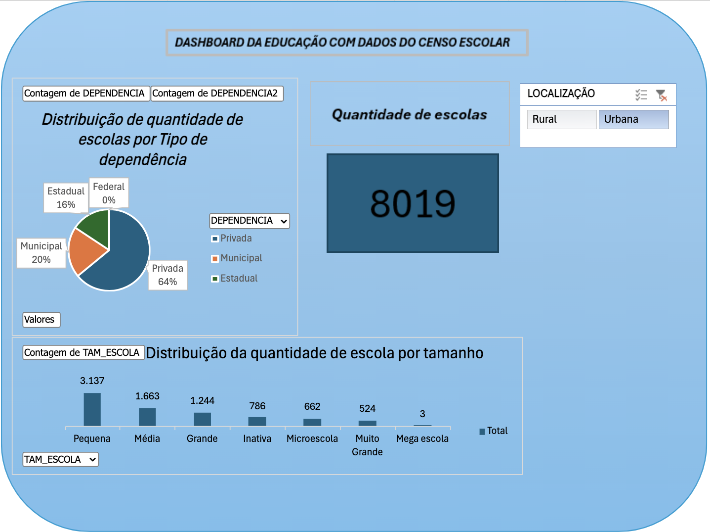
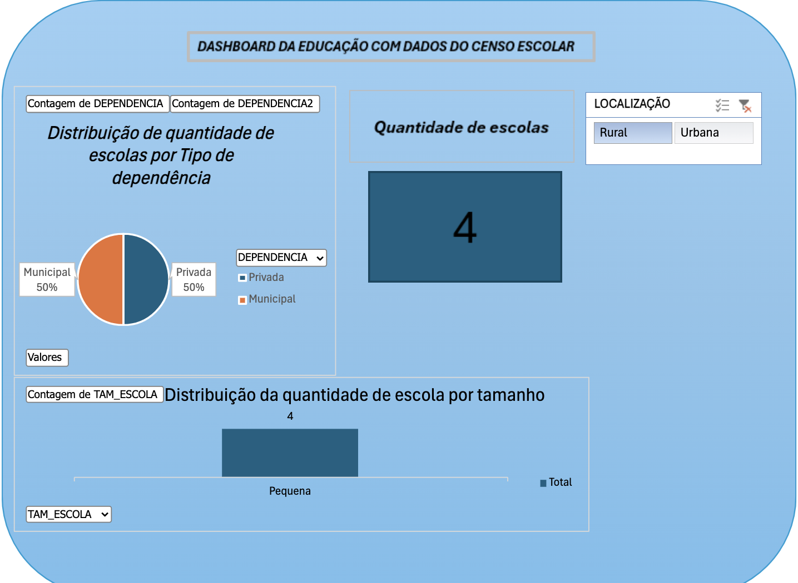
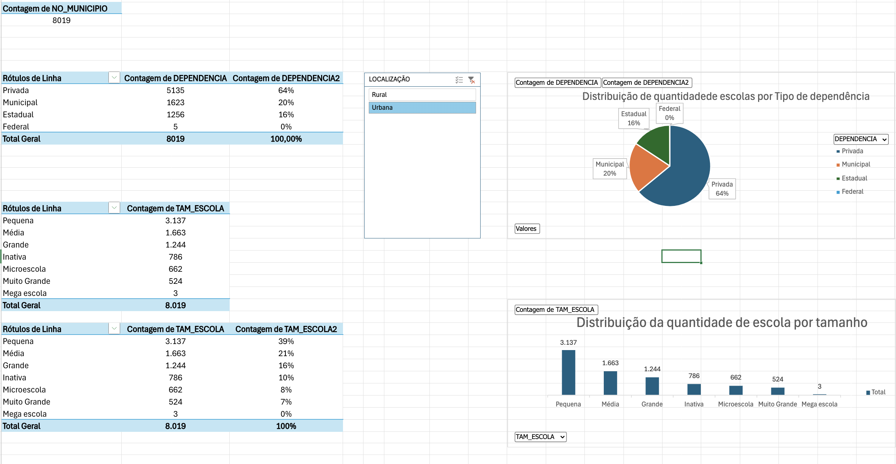
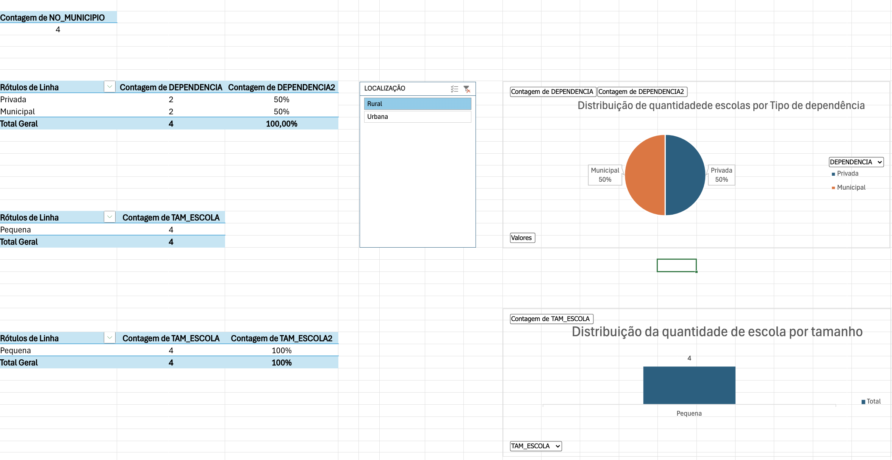

# Projeto 2 — Painel do Censo Escolar

## Objetivo

Este projeto apresenta uma análise dos Microdados do Censo Escolar da Educação Básica 2024.

A planilha foi utilizada para tratar e organizar os dados, criar variáveis calculadas e desenvolver tabelas e gráficos dinâmicos que permitem explorar informações educacionais de forma visual e interativa.

O resultado final inclui um dashboard construído a partir das análises realizadas no Excel.

## Arquivos

- `painel-censo-escolar-2024.xlsx` — planilha contendo a base tratada, tabelas dinâmicas, gráficos, segmentações e dashboard.
- `README.md` — documentação do projeto.

## Como usar

1. Abra o arquivo `painel-censo-escolar-2024.xlsx` no Microsoft Excel.
2. Acesse as abas com a base de dados tratada.
3. Consulte as tabelas dinâmicas e os gráficos produzidos.
4. Utilize as segmentações para filtrar as informações.
5. Acesse a aba do dashboard para visualizar os principais resultados de forma consolidada.

## Recursos utilizados

Entre os principais recursos utilizados na construção da planilha estão:

- **SE** para criação de variáveis e classificações;
- **PROCV** para associação e busca de informações;
- **Tabelas Dinâmicas** para síntese e análise dos dados;
- **Gráfico Dinâmico** para visualização dos resultados;
- **Segmentação de Dados** para aplicação de filtros interativos;
- **Dashboard** para apresentação consolidada dos indicadores.

## Prints do resultado

### Dashboard — Urbano

### Dashboard — Rural

### Tabela Dinâmica — Urbano

### Tabela Dinâmica — Rural

## Uso de Inteligência Artificial

**Ferramenta utilizada:** ChatGPT, da OpenAI.

**Para que foi utilizada:**  
A inteligência artificial foi utilizada como apoio na organização do projeto, na revisão da estrutura da planilha e na elaboração da documentação necessária para publicação no GitHub.

**Exemplo de prompt utilizado:**  
“Transforme em dashboard HTML.”

**O que foi ajustado manualmente:**  
O grupo revisou os dados, as variáveis calculadas, as tabelas e gráficos dinâmicos, as segmentações e a organização visual do dashboard no Excel.

---

## Fonte de Dados

**Fonte oficial:** Microdados do Censo Escolar da Educação Básica 2024 — Instituto Nacional de Estudos e Pesquisas Educacionais Anísio Teixeira (INEP).

**O que os dados representam:**  
Os microdados reúnem informações do Censo Escolar da Educação Básica referentes ao ano de 2024. A base permite analisar características das instituições de ensino e outras informações educacionais disponibilizadas pelo INEP.

**Estrutura dos dados:**  
O projeto utiliza variáveis da base original e colunas calculadas criadas durante o tratamento dos dados para possibilitar classificações, filtros e análises por meio de tabelas e gráficos dinâmicos.

---

### O que aprendemos com este projeto

O projeto permitiu aplicar técnicas de tratamento e análise de dados no Excel, utilizando funções, tabelas dinâmicas, gráficos e segmentações para transformar uma base extensa em informações mais fáceis de interpretar.

